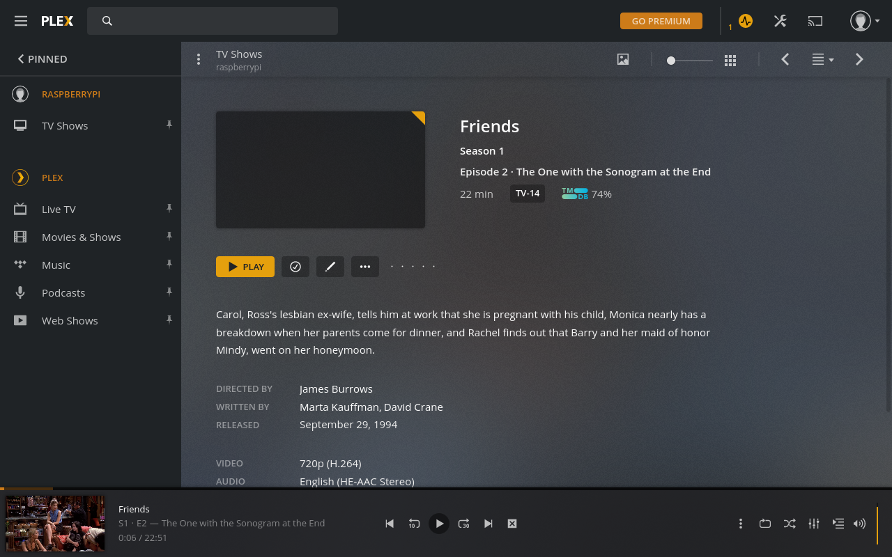

## Raspberry Pi 3 Home Server

##### Concept Design

| Concept Design                   | Final Output                 |
| -------------------------------- | ---------------------------- |
|  |  |

##### [1. SSH Setup](https://docs.github.com/en/github/authenticating-to-github/connecting-to-github-with-ssh/generating-a-new-ssh-key-and-adding-it-to-the-ssh-agent)

```shell
ssh-copy-id -i id_rsa.pub -o PreferredAuthentications=password pi@raspberrypi.local
```

##### [2. Cockpit](https://cockpit-project.org/)

```shell
sudo apt install cockpit
```

> http://raspberrypi.local:9090


##### 3. Mount Drive on Startup

```shell
sudo blkid
```

eg:

```shell
/dev/mmcblk0p1: LABEL_FATBOOT="boot" LABEL="boot" UUID="5DE4-665C" TYPE="vfat" PARTUUID="a9fad9e6-01"
/dev/mmcblk0p2: LABEL="rootfs" UUID="7295bbc3-bbc2-4267-9fa0-099e10ef5bf0" TYPE="ext4" PARTUUID="a9fad9e6-02"
/dev/mmcblk0: PTUUID="a9fad9e6" PTTYPE="dos"
/dev/sda1: UUID="6CEE-A6AE" TYPE="vfat" PARTUUID="21164028-01"
/dev/sda3: UUID="71eb8c46-747a-4d40-b04c-2ad101fcb550" TYPE="ext4" PARTUUID="21164028-03"
/dev/sda5: UUID="57abd1e6-9bea-4ea0-a417-f41ce4e801eb" TYPE="ext4" PARTUUID="21164028-05"
```

```shell
sudo mkdir /mnt/titan
sudo mkdir /mnt/atlas
sudo vi /etc/fstab
```

`eg: UUID=<uuid-of-your-drive> <mount-point> <file-system-type> <mount-option> <dump> <pass>`

```shell
UUID=71eb8c46-747a-4d40-b04c-2ad101fcb550 /mnt/atlas ext4 defaults 0 2
UUID=57abd1e6-9bea-4ea0-a417-f41ce4e801eb /mnt/titan ext4 defaults 0 2
```

##### 4. SAMBA Server

```shell
sudo mount -a
sudo apt install samba
vi /etc/samba/smb.conf
```

```shell
[titan]
comment = Titan
  path = /mnt/titan
  guest ok = no
  browseable = yes
  create mask = 0755
  valid users = pi
  directory mask = 0755
  read only = no

[atlas]
comment = Atlas
  path = /mnt/atlas
  guest ok = no
  browseable = yes
  create mask = 0755
  valid users = pi
  directory mask = 0755
  read only = no
```

```shell
sudo smbdpassw -a pi
```

> smb://raspberrypi.local


##### [5. Transmission](https://pimylifeup.com/raspberry-pi-transmission/)

```shell

sudo apt install transmission-daemon
sudo systemctl stop transmission-daemon

sudo mkdir -p /mnt/titan/torrent/torrent-inprogress
sudo mkdir -p /mnt/titan/torrent/torrent-complete

sudo chown -R pi:pi /mnt/titan/torrent/torrent-inprogress
sudo chown -R pi:pi /mnt/titan/torrent/torrent-complete

sudo vi /etc/transmission-daemon/settings.json
```

```json
...
"incomplete-dir": "/mnt/titan/torrent/torrent-inprogress",
"incomplete-dir-enabled": true,
...
"download-dir": "/mnt/titan/torrent/torrent-complete",
"rpc-password": "Your_Password",
"rpc-username": "Your_Username",
"rpc-whitelist": "192.168.*.*",
```

```shell
sudo vi /etc/init.d/transmission-daemon
```

```
USER=pi
```

```shell
sudo vi /etc/systemd/system/multi-user.target.wants/transmission-daemon.service
```

```
USER=pi
```

```shell
sudo systemctl daemon-reload
sudo chown -R pi:pi /etc/transmission-daemon
sudo mkdir -p /home/pi/.config/transmission-daemon/
sudo ln -s /etc/transmission-daemon/settings.json /home/pi/.config/transmission-daemon/
sudo chown -R pi:pi /home/pi/.config/transmission-daemon/
sudo systemctl start transmission-daemon
```

> http://raspberrypi.local:9091


##### [7. MYSql](https://www.digitalocean.com/community/tutorials/how-to-install-mariadb-on-ubuntu-18-04)

```shell
sudo apt install mariadb-server
sudo mysql
```

```sql
GRANT ALL ON *.* TO 'pi'@'localhost' IDENTIFIED BY 'raspberry' WITH GRANT OPTION;
exit
FLUSH PRIVILEGES;
```

##### [6. NextCloud](https://nextcloud.com/install/#instructions-server)

```shell
sudo apt install
sudo mkdir /var/www/html/nextcloud
cd /var/www/html/nextcloud
sudo wget https://download.nextcloud.com/server/installer/setup-nextcloud.php

sudo apt install apache2 libapache2-mod-php7.4
sudo apt install php7.4-gd php7.4-mysql php7.4-curl php7.4-mbstring php7.4-intl
sudo apt install php7.4-gmp php7.4-bcmath php-imagick php7.4-xml php7.4-zip
```

> http://raspberrypi.local/nextcloud

```shell
mkdir /mnt/titan/nextcloud
chmod -R 770 /mnt/titan/nextcloud
cd /mnt/titan/nextcloud
touch .ocdata
sudo chown www-data:www-data nextcloud
```


##### [7. Plex Server](https://pimylifeup.com/raspberry-pi-plex-server/)

```shell
sudo apt-get install apt-transport-https
curl https://downloads.plex.tv/plex-keys/PlexSign.key | sudo apt-key add -
echo deb https://downloads.plex.tv/repo/deb public main | sudo tee /etc/apt/sources.list.d/plexmediaserver.list
sudo apt-get update
sudo apt install plexmediaserver
```

> http://raspberrypi.local:32400/web


